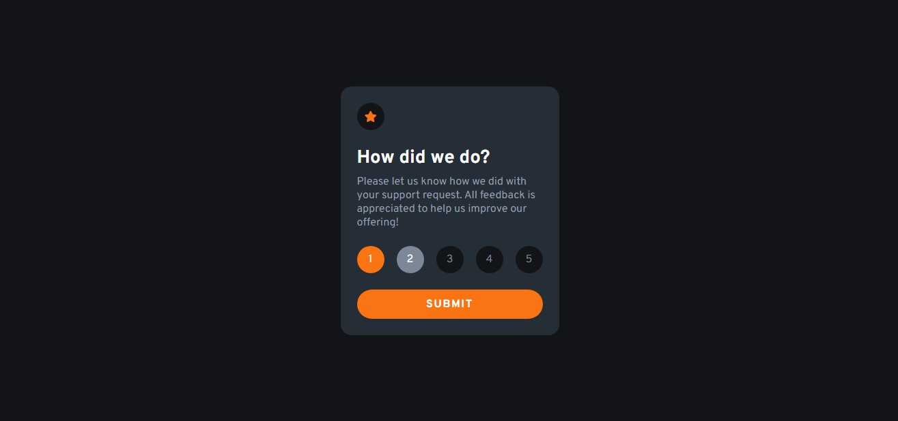
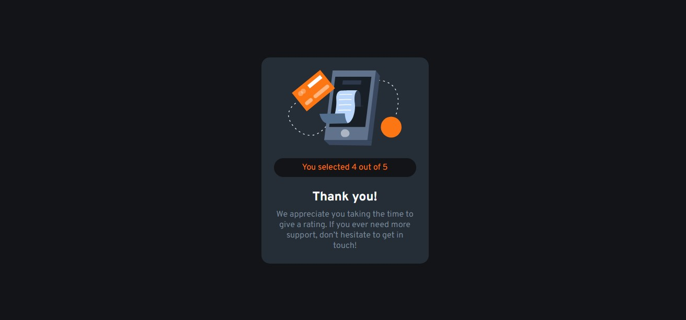

# Frontend Mentor - Interactive rating component solution

This is a solution to the [Interactive rating component challenge on Frontend Mentor](https://www.frontendmentor.io/challenges/interactive-rating-component-koxpeBUmI). Frontend Mentor challenges help you improve your coding skills by building realistic projects. 

## Table of contents

- [Overview](#overview)
  - [The challenge](#the-challenge)
  - [Screenshot](#screenshot)
  - [Links](#links)
- [My process](#my-process)
  - [Built with](#built-with)
  - [What I learned](#what-i-learned)
  - [Continued development](#continued-development)
  - [Useful resources](#useful-resources)
- [Author](#author)

## Overview

### The challenge

Users should be able to:

- View the optimal layout for the app depending on their device's screen size
- See hover states for all interactive elements on the page
- Select and submit a number rating
- See the "Thank you" card state after submitting a rating

### Screenshot

 That's what I did, the first image's the initial screen that we can see. 
 The second one, the result appears.

### Links

- Solution URL: [GitHub](https://github.com/BryanCarlos/Interactive-rating-component)
- Live Site URL: [GitHub Pages](https://your-live-site-url.com)

## My process

### Built with

- Semantic HTML5 markup
- CSS custom properties
- Flexbox
- CSS Grid
- Javascript

### What I learned

That's the first project I did all by myself, I tried my best to don't search for anything, but I couldn't. Some examples: how to change the radio button design and how to add and remove a class from a div using "classList".

### Continued development

I really need to improve my JS skill. JS isn't a hard language, but it's the first language that I'm trying to learn deeper. So for the next project I'll work harder to do a better JS code. 

### Useful resources

- [Stackoverflow](https://stackoverflow.com) - This helped me for design the radio button. I think it's a very usefull way to "kill" all your doubts.
- [BackeFront](https://backefront.com.br/verificar-radio-button-checado-javascript/) - This is an amazing article which helped me finally understand how to know which radio button the user check.

## Author

- GitHub - [@BryanCarlos](https://github.com/BryanCarlos)
- Frontend Mentor - [@BryanCarlos](https://www.frontendmentor.io/profile/BryanCarlos)
- LinkedIn - [@bryan-carlos-silva](https://www.linkedin.com/in/bryan-carlos-silva/)